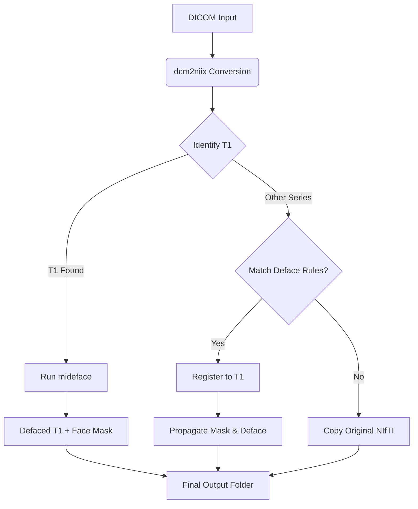

# DICOM → NIfTI + Defacing Pipeline (mideface + ANTsPy)

This project converts MRI DICOM series into compressed NIfTI (.nii.gz) using dcm2niix, then performs defacing using FreeSurfer's "mideface" on a chosen T1 series.

The resulting T1 face mask is rigidly propagated to other structural sequences using ANTsPy registration, and those sequences are defaced by zeroing voxels under the propagated mask.

Outputs are written per session, and a JSON report (metadata + conversion/skip/fail status) is saved inside each session's output folder.

---

## ⚙️ What this pipeline does

For each session folder (DICOM input):

1. Discover DICOM series folders (walks the directory tree).
2. Pre-filter out series below MIN_SLICES.
3. Choose the "best" T1 candidate by scoring SeriesDescription/ProtocolName + slice count.
4. Convert all kept series using dcm2niix (compressed NIfTI).
5. Filter usable NIfTIs based on MIN_VOL_DIM checks.
6. Run mideface on the selected T1 to produce: 
   * Defaced T1 NIfTI
   * Face mask (NIfTI)
7. Process other sequences: 
   * If the sequence matches defacing rules (logic_config), rigidly register to T1 and propagate the mask.
   * Deface by applying the propagated mask.
   * Otherwise, copy the original converted volume to final output.
8. Clean up temporary folders and keep only the final defaced/ directory.

### Workflow Visualization



---

## 📂 Repository structure

```text
.
├── Scripts/main.py
├── Scripts/license.txt              # You shoudl replace this license file with your own (recommended)
├── Scripts/paths_config.py          # YOU EDIT ONLY session_dir + output_dir paths here
├── Scripts/logic_config.py          # Defacing and T1-identification rules (usually no change)
├── requirements.txt
└── README.md
```

---

## 🛠 Key external dependencies (non-Python)

This project requires TWO external tools:

### 1. dcm2niix

Used to convert DICOM → NIfTI.

### 2. FreeSurfer (via provided Docker image)

Used for mideface and (if needed) mri_convert.

* Generates the defaced T1 and a face mask.

#### Load the provided FreeSurfer Docker image

A prebuilt Docker image tarball is provided. Download it, then load it into Docker:

```bash
docker load -i gliomatch-mideface_7.4.1.tar
```

#### FreeSurfer license

A license.txt file is provided in the repository under:

```text
Scripts/license.txt
```

This license file is used by FreeSurfer inside the container.

> Recommendation: obtain your own FreeSurfer license (preferred for long-term use) using:
> https://surfer.nmr.mgh.harvard.edu/registration.html

Once the Docker image is loaded and you have the license.txt file available, you can run the main script as usual.

---

## 🔧 Configuration (paths_config.py)

You ONLY need to change the following in paths_config.py:

* SESSION_DIR: Path to your root input directory.
* OUTPUT_DIR: Path where results will be written.

Nothing else is required to be changed for a typical run.

Notes:

* The pipeline scans SESSION_DIR for session folders (immediate subdirectories).
* It also supports the case where SESSION_DIR itself contains DICOMs directly.
* Each session is processed into: OUTPUT_DIR/<session_name>/defaced/

---

## 🧠 Logic rules (logic_config.py)

We have set up parameters in logic_config.py based on local test cases:

* T1 candidate identification keywords and priorities.
* Defacing inclusion/exclusion lists (structural_keywords, skip_keywords).
* Minimum matrix size rules.

Depending on your scanner naming conventions (SeriesDescription / ProtocolName), data characteristics, or machine environment variables, you may need to adjust these rules.

If the wrong series gets picked as T1, tune these first:

* t1_identification.keywords
* t1_identification.priority_keywords

---

## 📥 Installation

1. Create and activate a Python environment.

2. Install Python requirements:

   ```bash
   pip install -r requirements.txt
   ```
3. Install external tools:
   * Install dcm2niix and ensure it is on PATH (or set its path in paths_config.py).
   * Load the provided FreeSurfer Docker image as described above.

---

## 🚀 Running the pipeline

Basic run (using defaults from paths_config.py):

```bash
python main.py
```

Override input/output on the command line:

```bash
python main.py --session_dir /path/to/sessions --outdir /path/to/output
```

### Input assumptions

* SESSION_DIR can either: 
  * (A) contain session subfolders (recommended), or
  * (B) be a single session folder containing DICOMs directly.
* The script detects DICOM files using pydicom header parsing.

---

## 📤 Outputs

For each session, the output is located at:
OUTPUT_DIR/<session_name>/defaced/

Contains:

* Defaced T1: <t1name>\_defaced.nii.gz
* T1 face mask: <t1stem>\_deface_mask.nii.gz
* For other sequences: 
  * Defaced: <seqname>\_defaced.nii.gz (if defacing criteria matched)
  * Or Original: Original converted NIfTI copied as-is (if not a defacing candidate)
* Registration transforms (for defaced non-T1 sequences): 
  * <seqstem>\_to_t1.mat
* Session report JSON: 
  * <REPORT_FILENAME>.json (Metadata + conversion/skip/fail status)

Temporary folders (\_converted_tmp, mideface temp) are automatically cleaned up.

---

## ❓ Troubleshooting

1. "mideface: command not found"
   * Ensure the provided FreeSurfer Docker image is loaded (docker load -i gliomatch-mideface_7.4.1.tar).
   * Confirm Scripts/license.txt exists (or use your own FreeSurfer license).
2. dcm2niix fails
   * Confirm installation. If using explicit paths, check paths_config.DCM2NIIX_PATH.
3. T1 candidate identified
   * Your naming conventions differ. Update logic_config.py keywords.
4. Output contains only copied (non-defaced) sequences
   * Those sequences likely did not match defacing_logic rules (check structural_keywords, skip_keywords, or min_matrix_size).

<!-- end list -->